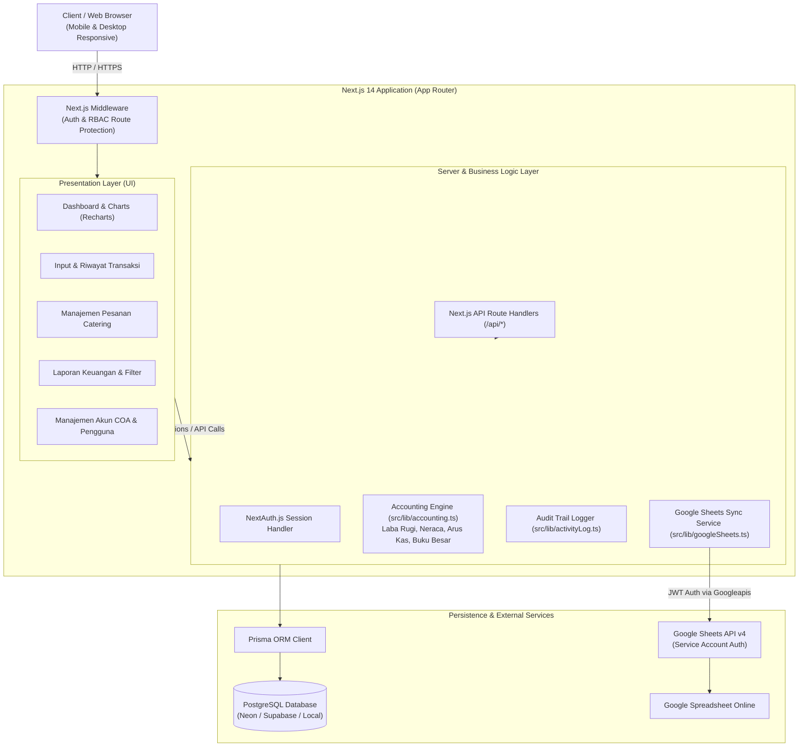
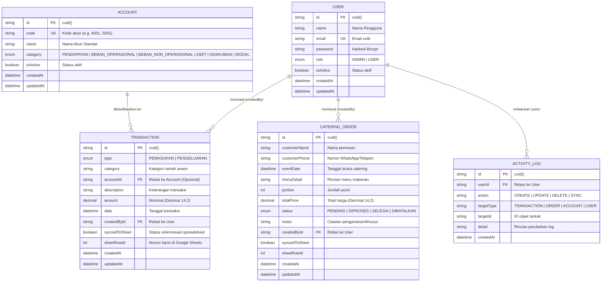
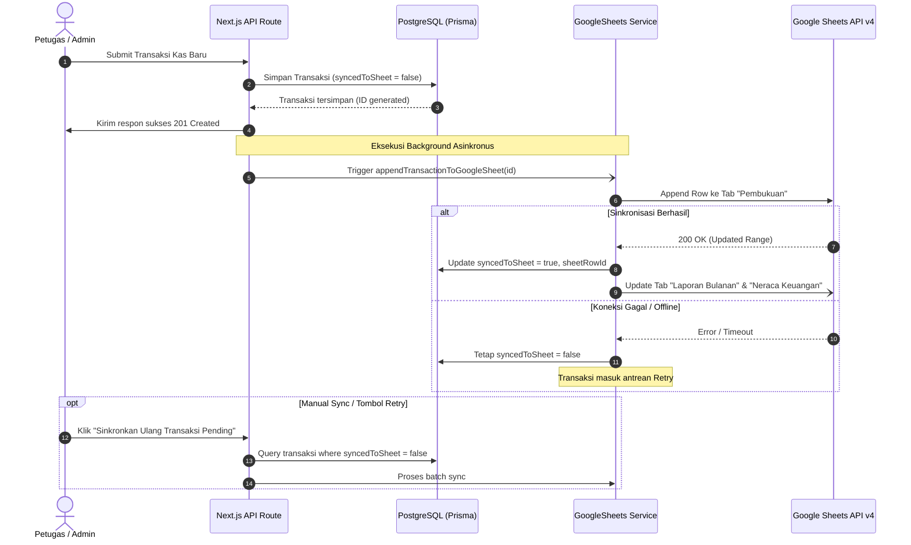

# 🏗 Dokumentasi Arsitektur Sistem & Logika Akuntansi

Dokumen ini menjelaskan rancangan arsitektur teknis, model basis data, alur autentikasi/otorisasi, serta logika kalkulasi akuntansi ganda yang diterapkan pada **Sistem Pembukuan & Manajemen Keuangan BUMDes Catering Desa Bogem**.

---

## 🏛 1. Diagram Arsitektur Tingkat Tinggi (High-Level Architecture)

---

## 🗄 2. Skema Basis Data & Entity Relationship Diagram (ERD)

Aplikasi menggunakan **PostgreSQL** yang dimodelkan dan dimigrasikan menggunakan **Prisma ORM**.

---

## 📊 3. Struktur Bagan Akun (Chart of Accounts / COA)

Sistem mengadopsi standar akuntansi yang disederhanakan agar mudah digunakan oleh pengurus BUMDes, namun tetap menghasilkan laporan akuntansi yang valid:

| Kode Akun | Nama Akun | Kategori Akun | Posisi Normal |
| :--- | :--- | :--- | :--- |
| **`1001`** | Kas Tunai & Rekening BUMDes Bogem | `ASET` (Aset Lancar) | Debit |
| **`3001`** | Modal Awal BUMDes Bogem | `MODAL` (Ekuitas) | Kredit |
| **`4001`** | Penjualan Catering Harian & Nasi Box | `PENDAPATAN` | Kredit |
| **`4002`** | Penjualan Pesanan Event & Prasmanan | `PENDAPATAN` | Kredit |
| **`4003`** | Pendapatan Sewa Peralatan Catering | `PENDAPATAN` | Kredit |
| **`4004`** | Pendapatan Usaha Lain-lain | `PENDAPATAN` | Kredit |
| **`5001`** | Beban Bahan Baku Makanan (Beras, Daging, Sayur) | `BEBAN_OPERASIONAL` | Debit |
| **`5002`** | Beban Kemasan, Box & Plastik | `BEBAN_OPERASIONAL` | Debit |
| **`5003`** | Beban Upah & Gaji Tenaga Masak | `BEBAN_OPERASIONAL` | Debit |
| **`5004`** | Beban Transportasi & Pengantaran | `BEBAN_OPERASIONAL` | Debit |
| **`5005`** | Beban Listrik, Gas Elpiji & Air | `BEBAN_OPERASIONAL` | Debit |
| **`5006`** | Beban Peralatan & Perlengkapan Dapur | `BEBAN_OPERASIONAL` | Debit |
| **`6001`** | Beban Administrasi Bank & Transfer | `BEBAN_NON_OPERASIONAL` | Debit |
| **`6002`** | Beban Non-Operasional Lain-lain | `BEBAN_NON_OPERASIONAL` | Debit |

---

## 🧮 4. Logika Kalkulasi Laporan Keuangan (`src/lib/accounting.ts`)

### A. Laporan Laba Rugi (*Income Statement*)
$$\text{Laba Kotor Operasional} = \sum \text{Pendapatan (4xxx)} - \sum \text{Beban Operasional (5xxx)}$$
$$\text{Laba Bersih Usaha} = \text{Laba Kotor Operasional} - \sum \text{Beban Non-Operasional (6xxx)}$$

### B. Neraca Keuangan (*Balance Sheet*)
1. **Total Aset / Aktiva**:
   $$\text{Total Aset} = \text{Aset Lancar (Kas/Bank)} + \text{Aset Tetap (Peralatan)}$$
   $$\text{Saldo Kas} = \text{Saldo Kas Awal} + \sum \text{Pemasukan Historis} - \sum \text{Pengeluaran Historis}$$
2. **Total Kewajiban & Ekuitas / Pasiva**:
   $$\text{Total Pasiva} = \text{Total Kewajiban (Utang)} + \text{Modal Awal} + \text{Laba Bersih Akumulasi}$$
3. **Keseimbangan (*Balance Check*)**:
   $$\text{Selisih} = |\text{Total Aset} - \text{Total Pasiva}|$$
   $$\text{Status} = \begin{cases} \text{SEIMBANG (BALANCED)}, & \text{jika Selisih} = 0 \\ \text{BELUM SEIMBANG}, & \text{jika Selisih} \neq 0 \end{cases}$$

### C. Laporan Arus Kas (*Cash Flow Statement*)
- **Saldo Awal Kas**: Saldo sebelum periode tanggal filter laporan.
- **Arus Kas Masuk**: Rekap seluruh pemasukan kas berdasarkan kategori selama periode.
- **Arus Kas Keluar**: Rekap seluruh pengeluaran kas berdasarkan kategori selama periode.
- **Saldo Akhir Kas**: $\text{Saldo Awal} + \text{Total Arus Kas Masuk} - \text{Total Arus Kas Keluar}$.

### D. Buku Besar (*General Ledger*)
- Mengagregasi mutasi debit/kredit pada satu akun tertentu dalam rentang tanggal.
- Menghitung **Saldo Berjalan (*Running Balance*)** baris-demi-baris dengan memperhitungkan saldo awal sebelum tanggal mulai.

---

## 🔄 5. Mekanisme Sinkronisasi Google Sheets & Toleransi Kesalahan

---

## 🔐 6. Keamanan & Role-Based Access Control (RBAC)

1. **Hashing Password**: Menggunakan `bcryptjs` dengan *salt rounds* 10.
2. **Session Handling**: Menggunakan JSON Web Tokens (JWT) terenkripsi dengan masa berlaku sesi yang aman.
3. **Route Middleware (`src/middleware.ts`)**:
   - Memastikan pengguna yang belum login dialihkan ke `/login`.
   - Melindungi rute administratif (`/users`, `/accounts`, `/logs`) agar hanya dapat diakses oleh peran `ADMIN`.
   - Petugas dengan peran `USER` hanya dapat mengakses dashboard operasional, transaksi kas, dan pesanan catering.
4. **Audit Trail Logging**:
   - Setiap mutasi data sensitif (tambah, edit, hapus) otomatis dicatat ke tabel `ActivityLog` bersama identitas pengguna dan waktu kejadian.
